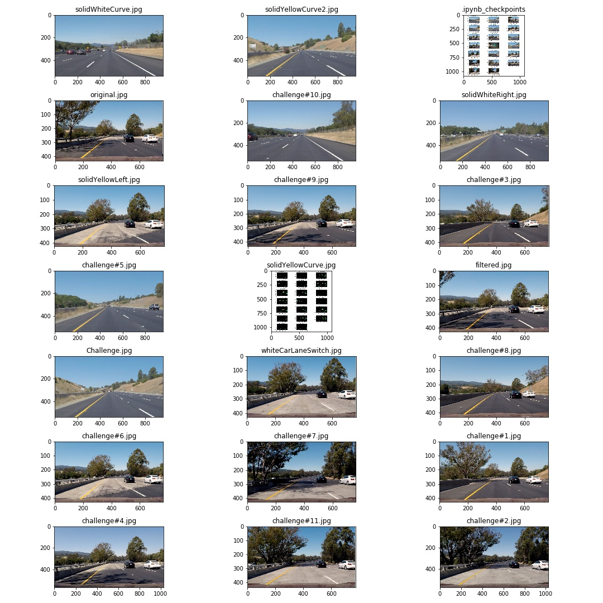
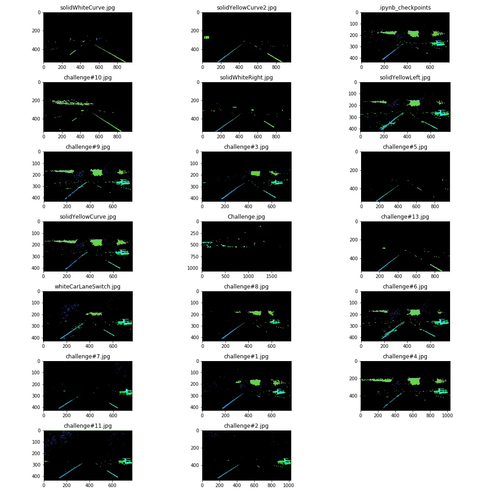

# **Finding Lane Lines on the Road**

## Xingshu Sun's Report
---
#### **Section I: Objective**

The goal of the project, by applying what we learn from the first module, is to develop a software pipeline that can detect lanes from a video recorded from the dashcam in a car driving on highway.

The success criteria involves testing on existing videos provided to verify the effectiveness of the pipeline.

---
#### **Section II: Pipeline**

My pipeline is based on the material we learned from the lecture with three major modification for enhancement:
1. color filtering on image (step#1)
2. adaptive algorithm for parameter optimization  (step#3)
3. evaluation of line selection (step#4)

Here is the detailed breakdown on the steps:

***Step#1: Color filtering***

The common colors for road lanes are yellow and white. Hence, it can greatly reduce the noise by filtering out other colors in the image. Instead of RBG, we firstly convert the image in HSL. Unlike RGB, HSL (Hue Saturation Lightness) uses "Hue" to control the color, "Saturation" to control the purity of the color, and "Lightness" to control the brightness, as illustrated in the below image. It allows us to pick the yellow and white color we need to filter the image.

A demonstration of the filter is here and we can see that we have successfully extracted features with yellow and white colors from the test images.

***Step#2: Gray & Canny & Area of Interest***

Here we follow the instruction from the lecture, i.e., apply grayscale conversion with Gaussian smoothing to Canny edge detection to Area of Interest.

We did some investigation on how the high threshold parameter in the Canny edge impacts the result and minimal difference was seen between 200 and 400.

***Step#3: Hough Transform***
In this step, we apply the Hough transform to the images generated from step#2. We do see the key parameters in the "cv2.HoughLinesP" function, such as "min_line_len", can change the result substantially. Two key notes are worth mentioning:

* The higher requirement we have (e.g., the higher numbers of the minimal length or the minimum number of intersections) allows us to eliminate noise and achieve better line extraction.
* If the requirement is too high, we may fail to detect any line.

Hence, we start off with what is considered a high requirement and adaptively lower the requirement if no line is detected. This is enabled by a while loop. We also separate left and right lane detection. For example, if the right lane is detected but not the left lane, we will only lower the requirement for left lane detection but not right lane in the next iteration, and vice versa.

***Step#4: Add Line extrapolation***

Lastly, we perform the extrapolation. This follows the following sub-steps:

* Group the lines detected as left lane and right lane by their location, i.e., lines on the left half of the image only used for left lane
* Filter out line by the slope, i.e., the slope must negative for left lane and positive for right lane
* Polyfit all the points for each lane and if the slope obtained is greater than twice of the diagonal slope of the image, it is considered as failure and will require lower requirement in Step#3. Twice of the diagonal slope of the image is determined from experimenting.
* Finally add the extrapolated line to the original image.

---

#### **Section III: Limitation**

Here are what I consider as major limitation:

1. The pipeline replies on the quality of the image. If the light condition is poor, it can affect color filter and consequently fail the algorithm
2. The adaptive approach is relatively slow to process with the computation power I have on the cluster.
3. The algorithm may not be able to handle a curve turn of the car.

---

#### **Section IV: Improvement**

I think one of the improvements I would like to incorporate is the memory of the lane. Lane detection in frame should be able to leverage the prior detection in the previous frame as initial guess to speed up and optimize the detection process.
